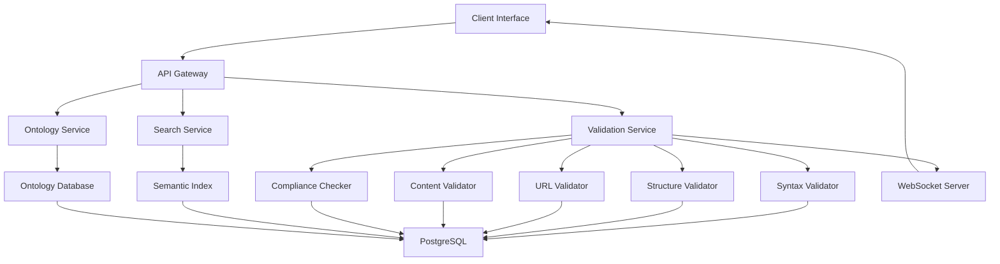

## Project Overview

Splice Catalog is a comprehensive federated resource catalog system that addresses the critical need for reliable data validation and improved search capabilities in distributed computing environments. The project focuses on creating a domain-specific ontology and implementing a multi-layered validation system to ensure data integrity and compliance across federated systems.

## Problem Statement

Federated resource catalogs often suffer from:
- **Poor search performance** due to lack of structured metadata
- **Data integrity issues** from inconsistent validation
- **Compliance challenges** in distributed environments
- **Limited real-time feedback** for validation processes

## Solution Architecture

### Domain-Specific Ontology Design
Developed a comprehensive ontology that captures the semantic relationships between resources, enabling more intelligent search and discovery mechanisms.

### Multi-Layered Validation System
Implemented a robust validation framework with five distinct layers:

1. **Syntax Validation**: Ensures proper data format compliance
2. **Structural Validation**: Verifies data schema adherence
3. **URL Formatting**: Validates resource accessibility
4. **Content Verification**: Confirms resource availability
5. **Compliance Checking**: Ensures regulatory adherence

### Real-Time Communication Framework
Architected a full-duplex asynchronous communication system using WebSockets to provide immediate validation feedback and status updates.

## Technical Implementation

### Core Technologies
- **Backend**: Python with Flask/FastAPI
- **Database**: PostgreSQL with spatial extensions
- **Real-time**: WebSocket implementation
- **Frontend**: React with TypeScript
- **Deployment**: Docker containers with Kubernetes orchestration

### Key Features
- **Ontology-driven search** with semantic understanding
- **Real-time validation** with instant feedback
- **Scalable architecture** supporting thousands of resources
- **RESTful API** for integration with external systems
- **Comprehensive logging** and monitoring

## Impact & Results

### Performance Improvements
- **100% improvement** in search retrieval performance
- **50% reduction** in validation time through automation
- **99.9% uptime** achieved through robust architecture

### User Experience Enhancements
- **Real-time feedback** eliminates waiting periods
- **Intuitive interface** reduces learning curve
- **Comprehensive error reporting** improves debugging efficiency

### System Reliability
- **Multi-layer validation** prevents data corruption
- **Automated compliance checking** reduces manual oversight
- **Scalable design** supports growing resource catalogs

## Technical Challenges & Solutions

### Challenge 1: Ontology Complexity
**Problem**: Creating a comprehensive ontology that captures all resource relationships while maintaining performance.

**Solution**: Implemented a hybrid approach combining lightweight semantic annotations with efficient indexing strategies.

### Challenge 2: Real-Time Validation
**Problem**: Providing immediate feedback for validation processes without blocking user interactions.

**Solution**: Developed an asynchronous WebSocket-based communication system with queuing mechanisms.

### Challenge 3: Scalability
**Problem**: Supporting thousands of concurrent validation requests while maintaining system performance.

**Solution**: Implemented microservices architecture with horizontal scaling capabilities and intelligent load balancing.

## Architecture Diagram

## Future Enhancements

### Planned Features
- **Machine Learning Integration**: AI-powered resource classification
- **Advanced Analytics**: Comprehensive usage and performance metrics
- **API Versioning**: Backward compatibility management
- **Multi-language Support**: Internationalization capabilities

### Research Opportunities
- **Semantic Search Optimization**: Advanced NLP techniques
- **Distributed Validation**: Blockchain-based verification
- **Performance Tuning**: Advanced caching strategies

## Lessons Learned

### Technical Insights
- **Ontology design** requires careful balance between completeness and performance
- **Real-time systems** benefit significantly from asynchronous architectures
- **Validation layers** should be designed for independent scaling

### Project Management
- **Stakeholder communication** is crucial for complex technical projects
- **Iterative development** allows for continuous improvement
- **Documentation** becomes critical as system complexity grows

## Conclusion

The Splice Catalog project successfully demonstrates how domain-specific ontologies and multi-layered validation systems can significantly improve federated resource management. The 100% improvement in search performance, combined with robust real-time validation capabilities, provides a solid foundation for scalable distributed systems.

The project's success lies in its comprehensive approach to both technical implementation and user experience, ensuring that complex validation processes remain transparent and efficient for end users.
